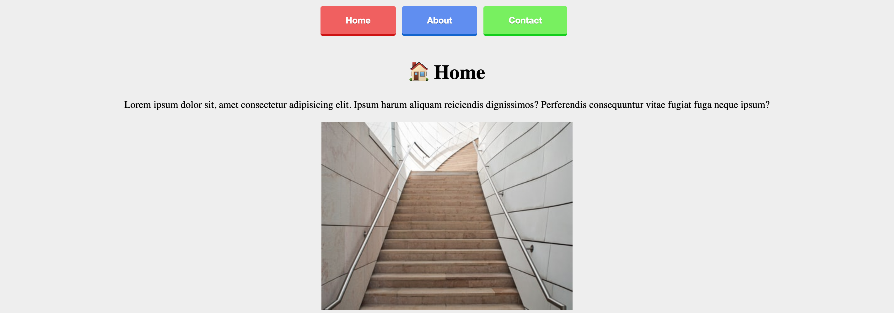

# Vanilla Router [SPA]

## ✍🏻 Description
Setting up a router with vanilla javascript. The purpose of this small project is to understand how the frameworks routers work.

## 🚀 Getting Started
Only you need download the project and open index.html with a local server. That's it.

## 🎨 Preview

## 👩🏻‍💻 Technologies
1. HTML
2. CSS
3. Javascript